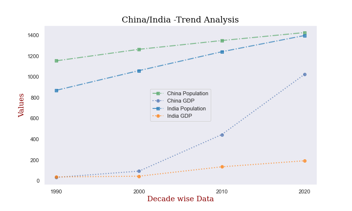
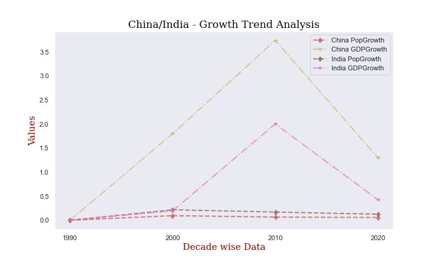
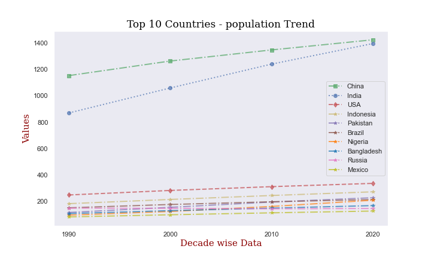
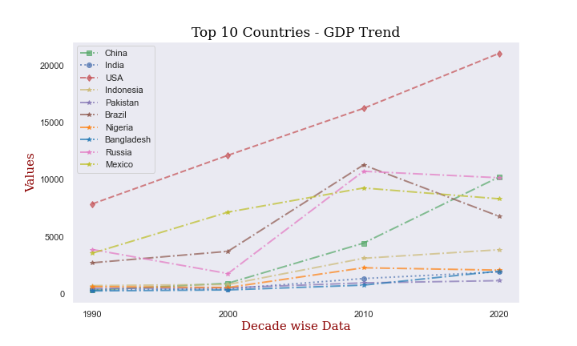
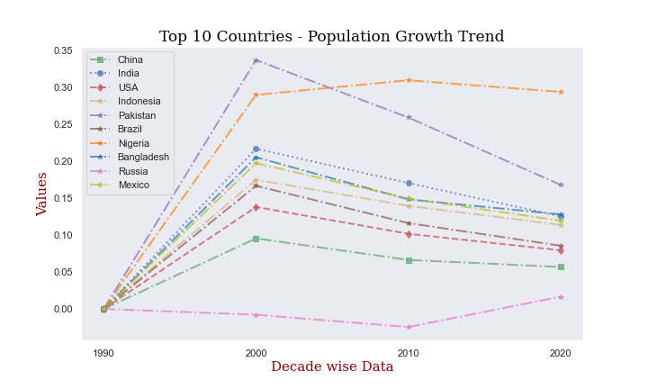
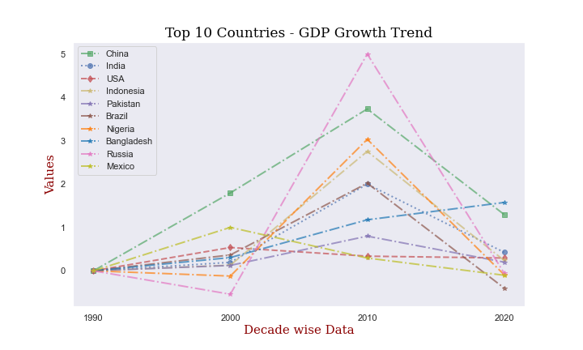

# Project 3 
Talkin’ Bout The Population! 

# Member Names
Mohamed Bilal

Subodh Chintawar

Joshua Cressaty

Juvante Gant

Chris Howard

Giovanna Lizzio

Hassan Mohamed

Indra Nandagopal

Connor Starrett 

Steven Rufus

Juhita Vijjali

# Group Name 
Data The Explorers

# Project Description/Outline
We are comparing the GDP and population of different countries across several decades and creating a dashboard page with multiple charts that update from the same data.

- Toggles for decades of population growth and GDP growth. GDP and Population growth percentages will be visualized by their respective gradients.

- The map will display the toggleable growth gradients of each nation (possibly along the borders), and then selecting a nation will display the graphs of the nation’s data.

- We will apply the latitude and longitude data using d3.js.

# Research Questions to Answer

1. How did national populations increase in comparison between 1990 and 2020?

2. How did national GDPs increase in comparison between 1990 and 2020?

3. What is the relationship between GDP growth, population growth, and population density between 1980 and 2020? 

# Datasets:
https://population.un.org/dataportal/about/dataapi

https://www.kaggle.com/datasets/iamsouravbanerjee/world-population-dataset/metadata

http://data.un.org/Data.aspx?q=GdP&d=SNAAMA&f=grID%3A101%3BcurrID%3AUSD%3BpcFlag%3A1

https://population.un.org/dataportalapi/api/v1/data/indicators/54/locations/428,682,860/start/1995/end/2000

https://population.un.org/dataportalapi/api/v1/locationsWithAggregates

# World Population Visualizations:
## 1.   Flask App:
### World map with location markers:

### World map with population layers:

## 2.   Heat Maps:
### World Heat Map - GDP:

### World Heat Map - Population

## 3.   China Vs India - Population & GDP

## 4.   Trend Analysis on Top 10 Populated Countries - 
### `China, India, United States of America, Indonesia, Pakistan, Brazil, Nigeria, Bangladesh, Russian Federation, Mexico` 

